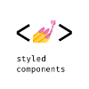

# Hello I'm Casper 🌊

A 19 year old guy from Poland. I'm still learning English. 🤓

## ✨ Info

- 🍕 I love pizza ❤️
- 🫂 My discord `SARF#3480`
- 👨‍💻 All of my projects are available at **_not ready yet..._**
<!-- <a href="http://zmudakacper.pl">**zmudakacper.pl**</a> -->

## 🛠 Technologies and tools

**What I'm using:**

<p>
    </img>
    </img>
    </img>
    </img>
    </img>
    </img>
    </img>
    </img>
    </img>
</p>

**What I am interested in learning at some point:**

<p>
    </img>
    </img>
    </img>
    </img>
    </img>
    </img>
</p>

## 📊 Github Statistics


[](https://github.com/anuraghazra/github-readme-stats)

## 🚧 Installed extensions (with authors)

- Bearded Theme _(BeardedBear)_
- Bearded Icons _(BeardedBear)_
- Discord Presence _(Crawl)_
- HTML CSS Support _(ecmel)_
- JavaScript (ES6) code snippets _(charalampos karypidis)_
- Live Sass Compiler _(Glenn Marks)_
- Live Server _(Ritwick Dey)_
- Markdown Preview Enhanced _(Yiyi Wang)_
- Prettier - Code formatter _(Prettier)_
- Sass _(Syler)_
- SmoothType _(spikespaz)_
- Trailing Spaces _(Shardul Mahadik)_

## 🔮 Visual Studio Code settings

```json
{
	//themes and colors
	"workbench.colorTheme": "Bearded Theme Arc Blueberry",
	"workbench.iconTheme": "bearded-icons",
	"workbench.colorCustomizations": {
		"editorBracketHighlight.foreground1": "#ffd700",
		"editorBracketHighlight.foreground2": "#ff00ff",
		"editorBracketHighlight.foreground3": "#00bfff",
		"editorBracketHighlight.foreground4": "#7cfc00",
		"editorBracketHighlight.unexpectedBracket.foreground": "#ff0000"
	},

	//settings
	"files.autoSave": "afterDelay",
	"liveServer.settings.donotShowInfoMsg": true,
	"editor.formatOnSave": true,
	"files.autoSaveDelay": 500,
	"editor.bracketPairColorization.enabled": true,
	"window.commandCenter": true,
	"git.confirmSync": false,
	"liveServer.settings.CustomBrowser": "Brave Browser.app",
	"liveServer.settings.donotVerifyTags": true,
	"editor.smoothScrolling": true,
	"editor.cursorSmoothCaretAnimation": true,
	"workbench.list.smoothScrolling": true,
	"terminal.integrated.smoothScrolling": true,
	"editor.wordWrap": "on",
	"editor.linkedEditing": true,
	"editor.cursorBlinking": "smooth",
	"editor.fontSize": 18,
	"editor.tabSize": 2,
	"window.zoomLevel": -1,
	"editor.cursorWidth": 3,
	"editor.letterSpacing": 1,
	"editor.lineHeight": 30,
	"workbench.startupEditor": "none",
	"terminal.integrated.cursorStyle": "line",
	"terminal.integrated.fontSize": 17,
	"files.associations": {
		"*.kit": "html"
	},

	//sass
	"liveSassCompile.settings.formats": [
		{
			"format": "expanded",
			"extensionName": ".css",
			"savePath": "/css"
		}
	],
	"liveSassCompile.settings.autoprefix": ["> 1%", "last 2 versions"],

	//prettier
	"editor.defaultFormatter": "esbenp.prettier-vscode",
	"prettier.arrowParens": "avoid",
	"prettier.jsxSingleQuote": true,
	"prettier.bracketSameLine": true,
	"prettier.singleQuote": true,
	"prettier.useTabs": true,
	"prettier.printWidth": 120,

	//other
	"emmet.triggerExpansionOnTab": true,
	"[html]": {
		"editor.defaultFormatter": "vscode.html-language-features"
	},
	"emmet.syntaxProfiles": {
		"html": {
			"inline_break": 2
		}
	},
	"emmet.variables": {
		"lang": "pl"
	}
}
```
